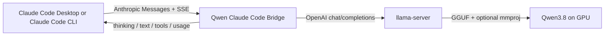

# Qwen3.8-27B for Claude Code Desktop

Run Qwen3.8-27B locally inside the **Claude Code Desktop client** with native
reasoning, vision, tools and streaming through a small, dependency-free
Anthropic Messages API bridge.

The same bridge also supports the separate **Claude Code CLI** terminal client.
The Desktop client and CLI use different connection settings; both setup paths
are documented below.

> **Validated hardware:** NVIDIA GeForce RTX 5090 32 GB<br>
> **Validated model:** Qwen3.8-27B (community Q6 GGUF, with the matching vision projector)

The BLACKFURY profiles, context limits, MTP settings and benchmark results in
this repository were measured with the 27B model on a single RTX 5090. They
should not be treated as universal results for other GPUs or Qwen3.8 sizes.

The bridge converts Claude Code's Anthropic-format requests into an
OpenAI-compatible request for `llama-server`, then converts text, native Qwen
reasoning, tool calls, images and streamed events back into the format Claude
Code expects.

This repository does **not** contain model weights, Claude binaries, or a
modified Claude client.

## What works

- Claude Code gateway model discovery (`GET /v1/models`)
- Anthropic Messages requests (`POST /v1/messages`)
- optional token-count endpoint (`POST /v1/messages/count_tokens`)
- streaming text and native Qwen `reasoning_content`
- historical reasoning preservation across agent turns
- tool definitions, tool calls and tool results
- base64 and URL image input
- separate advertised text and vision context limits
- `low`, `medium`, and `xhigh` Qwen reasoning mapping
- Qwen's official thinking-mode sampling defaults
- SSE keep-alive pings during long silent reasoning pauses
- optional localhost gateway credential

## Architecture



Claude Code officially supports an Anthropic-format gateway through
`ANTHROPIC_BASE_URL`, and gateway model discovery through
`CLAUDE_CODE_ENABLE_GATEWAY_MODEL_DISCOVERY=1`. See the
[Anthropic connection guide](https://code.claude.com/docs/en/llm-gateway-connect)
and [gateway protocol reference](https://code.claude.com/docs/en/llm-gateway-protocol).

## Requirements

- Node.js 20 or newer
- a recent `llama.cpp` build with Qwen3.8 support
- a Qwen3.8 GGUF
- the matching `mmproj` GGUF for vision
- enough GPU memory for the model, KV cache, compute buffers and projector
- Claude Code Desktop with Third-Party Inference enabled, or Claude Code CLI

The official Qwen3.8 model card describes a native 262,144-token context,
vision/video support, MTP heads, and `low`/`medium`/`xhigh` reasoning:
[Qwen/Qwen3.8-27B](https://huggingface.co/Qwen/Qwen3.8-27B/blob/main/README.md).

## Quick start on Windows

### 1. Create the local config

```powershell
Copy-Item .\config\models.example.json .\config\models.json
```

Edit `config/models.json` if your `llama-server --alias` differs from
`qwen3.8-27b-local`.

The Claude-visible model ID must contain `claude` or `anthropic`. Claude Code
filters out discovered IDs that contain neither string.

### 2. Start Qwen3.8

Text profile, 200K context, Q4 KV, MTP x3:

```powershell
.\scripts\start-llama-server.ps1 `
  -LlamaServer 'D:\path\to\llama-server.exe' `
  -Model 'D:\models\Qwen3.8-27B-Q6.gguf'
```

Vision profile, 128K context, matching projector:

```powershell
.\scripts\start-llama-server.ps1 `
  -LlamaServer 'D:\path\to\llama-server.exe' `
  -Model 'D:\models\Qwen3.8-27B-Q6.gguf' `
  -Mmproj 'D:\models\mmproj-Qwen3.8-27B-F16.gguf' `
  -Vision
```

The script keeps the process in the foreground. Closing it unloads the model.
Use a separate, ownership-aware model router if you need automatic swaps
between the 200K text profile and the 128K vision profile.

### 3. Start the bridge

```powershell
.\scripts\start-gateway.ps1 -Token 'choose-a-local-token'
```

Default endpoints:

- `llama-server`: `http://127.0.0.1:8093/v1`
- bridge: `http://127.0.0.1:8094`

### 4. Connect Claude Code CLI (terminal)

For one PowerShell session:

```powershell
$env:ANTHROPIC_BASE_URL = 'http://127.0.0.1:8094'
$env:ANTHROPIC_AUTH_TOKEN = 'choose-a-local-token'
$env:CLAUDE_CODE_ENABLE_GATEWAY_MODEL_DISCOVERY = '1'
claude
```

For persistent CLI and background-agent routing, merge
`examples/claude-code-settings.json` into
`%USERPROFILE%\.claude\settings.json`. Do not commit a real credential into a
project settings file.

Run `/status` to confirm the base URL, then `/model` to select
`LOCAL · Qwen3.8 27B · 200K/128K`.

### 5. Connect Claude Code Desktop (desktop client)

Anthropic's supported desktop path is:

1. Help → Troubleshooting → Enable Developer Mode.
2. Let the app restart.
3. Developer → Configure Third-Party Inference.
4. Enter `http://127.0.0.1:8094` and the same local token.
5. Restart the local Code session and select the discovered model.

Claude Desktop reads this Third-Party Inference configuration instead of the
CLI's `ANTHROPIC_BASE_URL` setting. Anthropic documents this distinction in its
[desktop gateway instructions](https://code.claude.com/docs/en/llm-gateway-connect#desktop-app).

## Verify before real work

```powershell
node --test .\tests\*.test.mjs
.\scripts\test-live.ps1 -Token 'choose-a-local-token'
```

The test suite covers translation, discovery, authentication, native thinking,
vision blocks, dynamic context limits and tool calls. The live test requires a
running Qwen server and verifies the actual final text, not merely the presence
of an SSE frame.

## Qwen3.8 defaults used here

For thinking mode the official model card recommends:

| Setting | Value |
|---|---:|
| temperature | `1.0` |
| top_p | `0.95` |
| top_k | `20` |
| min_p | `0.0` |
| presence penalty | `0.0` |
| repetition penalty | `1.0` |
| reasoning effort | `xhigh` default; `medium`; `low` |

The model card also warns that a lower per-turn reasoning effort can increase
total task time when it causes retries. That matched our long Claude Code test:
`low` still reasoned heavily, but maintained a multi-hour agent workflow.

The launcher enables llama.cpp MTP with three draft tokens. `llama.cpp`
documents `--spec-type draft-mtp`, `--spec-draft-n-max`, and
`--spec-draft-p-min` in its
[server README](https://github.com/ggml-org/llama.cpp/blob/master/tools/server/README.md).
Treat x3 and `p_min=0.15` as a measured hardware profile, not a universal best
value.

## Important limits

- A single `llama-server` process has one fixed KV-cache size. Advertising
  200K text and 128K vision only becomes truly dynamic when a router restarts
  the backend with the matching profile.
- Token counting is conservative estimation, not the model tokenizer. Leave a
  reserve and compact before the hard limit.
- A Q6 27B model plus 200K Q4 KV is close to the limit of a 32 GB GPU. Vision
  needs additional VRAM for `mmproj`, hence the 128K example profile.
- Adding a gateway credential overrides the saved claude.ai login for that
  local session. Anthropic-hosted Remote Control is unavailable while a custom
  gateway is active.
- The bridge exposes localhost only by default. Do not bind it to the LAN or
  Internet without real authentication and firewall rules.

## Documentation

- [Architecture and protocol mapping](docs/ARCHITECTURE.md)
- [Same Qwen model in Hermes vs Claude Code](docs/HERMES-VS-CLAUDE-CODE.md)
- [Complete porting checklist](docs/PORTING-CHECKLIST.md)
- [Troubleshooting](docs/TROUBLESHOOTING.md)
- [BLACKFURY Qwen benchmark audit](docs/BLACKFURY-QWEN-AUDIT.md)
- [Qwen3.8 vs Ornith 1.5 R benchmark comparison](docs/ORNITH-COMPARISON.md)

## License and model terms

Bridge code is licensed under Apache License 2.0. Qwen3.8's official model
repository currently declares Apache-2.0; a community GGUF or fine-tune may
use different terms.
Verify the license of the exact weights you distribute. Model weights are not
covered by this repository's Apache-2.0 license.

